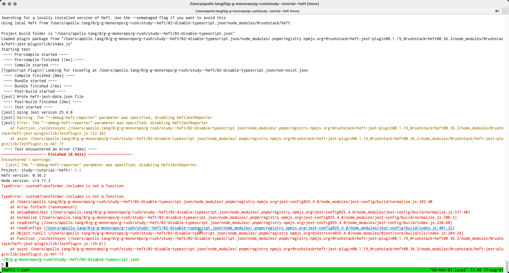

### This is continue of study from [https://github.com/ApolloTang/study--heft/tree/main/01-tutorial](https://github.com/ApolloTang/study--heft/tree/main/01-tutorial) but with typescript disabled.

According to this comment: 

[https://github.com/microsoft/rushstack/issues/2515#issuecomment-895595382](https://github.com/microsoft/rushstack/issues/2515#issuecomment-895595382)

I can disable heft runining typescript.json.

However, after disabling typescript.json, heft-jest no longer run because heft-jest required transpiler output. 


To fix this I attempted to use babel-jest: 


However, I can't get it to work, got error message:
 
```
TypeError: customTransformer.includes is not a function
```



