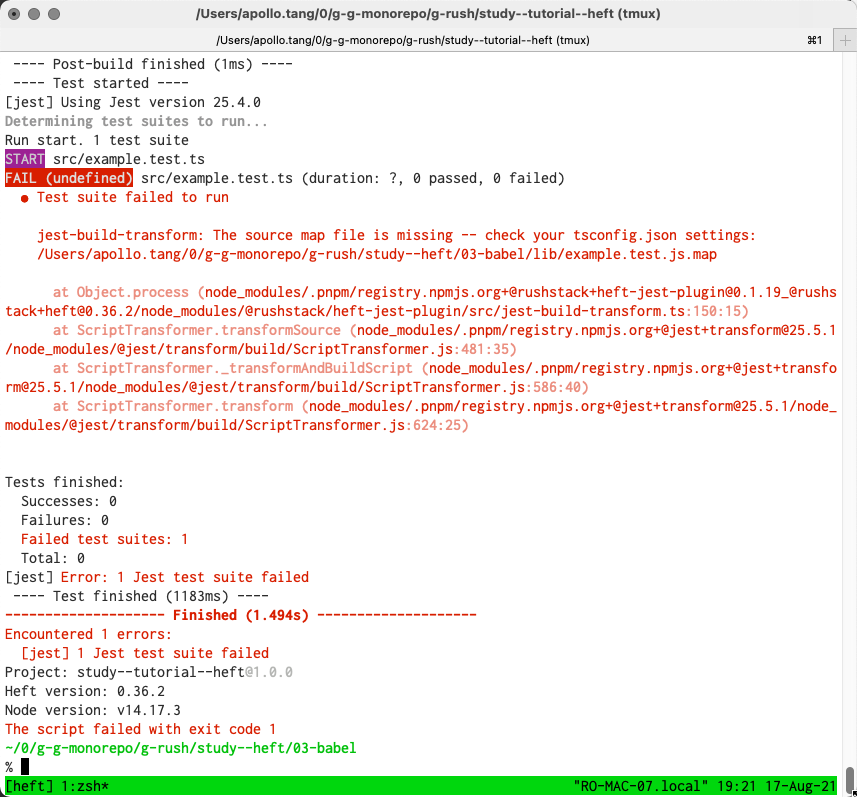

According to this comment: 

[https://github.com/microsoft/rushstack/issues/2515#issuecomment-895595382](https://github.com/microsoft/rushstack/issues/2515#issuecomment-895595382)

I can disable heft runining typescript.json.

This study replaced typescript.json with `@babel/preset-typescript`

Note that heft-jest plug-in required source-map to run: 

This can be easily fix by configure babel to emit source map:

----

However, after typescript.json is disable I am no sure how to run heft eslint task. 